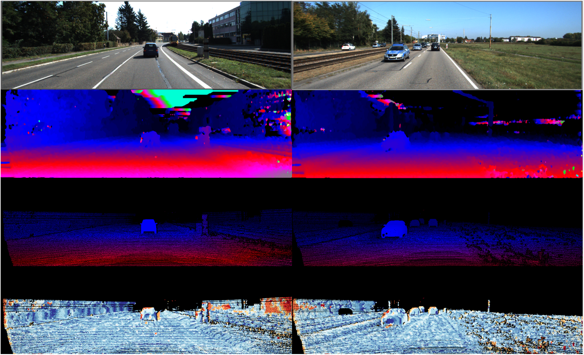

# Stereo_Vision

The network was trained using KITTI 2015 dataset : http://www.cvlibs.net/datasets/kitti/eval_scene_flow.php?benchmark=stereo.
The trained network was then implemented on FPGA. 
The python and VHDL codes will be uploaded.

will be updated.....

# Reults

